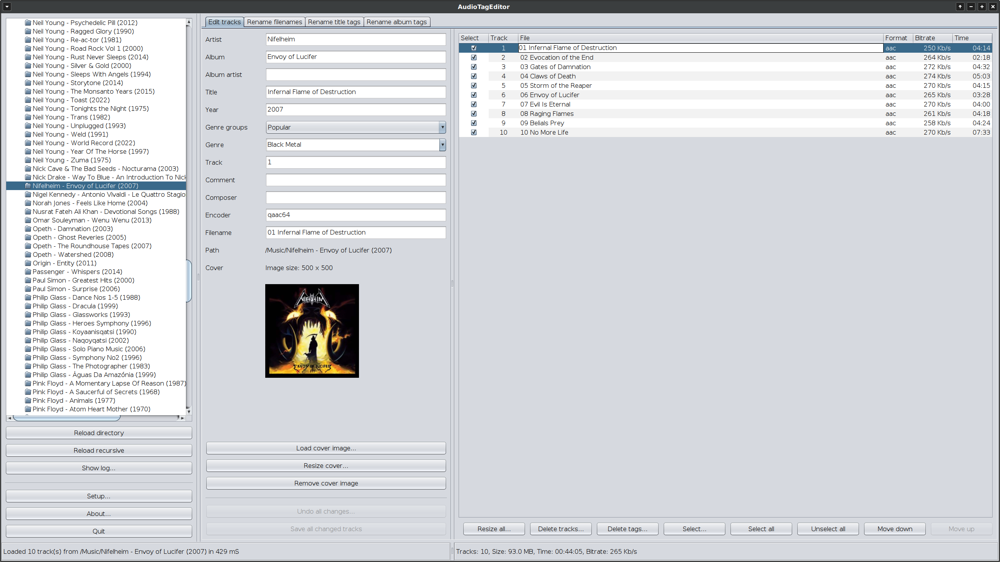

# AudioTagEditor

## About
AudioTagEditor is a metatag editor for audio files written in Kotlin.  
It can edit common audio files and tags.  
And also do batch operations on selected tracks.  
AudioTagEditor is written in kotlin and released under the [GNU General Public License v3.0](LICENSE).  

## Download
Download AudioTagEditor from [here](https://github.com/gnuwimp/AudioTagEditor/releases).  
Install [Java](https://java.com).  

## Usage
Double-click on the jar file to start the program in windows.  
Or run it from the command line with <code>java -jar AudioTagEditor.jar</code>.  
AudioConverter has been tested on Windows 10 and Ubuntu 25.04.  

## Screenshots

## Changes
<pre>
1.3:    Added resizing of cover image for current track or all selected tracks.
        Tracks can now be loaded for selected directory and all sub directories.
        Added settings for font size and number of threads to use.
        Added info message for all selected tracks (size, time and average bitrate).
        Bug fixes and improvements.

1.2:    Improved genre list selection.
        Made regex usage optional in remove/replace strings.
        Bug fixes and improvements.

1.12.2: Minor fixes and updated Jaudiotagger library.

1.12.1: Minor bug fix and updated Jaudiotagger library.

1.12:   Tags that are not used in AudioTagEditor are now removed when saving tags to audio file.

1.11:   Updated Jaudiotagger library and added it to the source tree.

1.1:    Renamed from gTagger to AudioTagEditor.
        UI changes.
        Bug fixes.
</pre>
